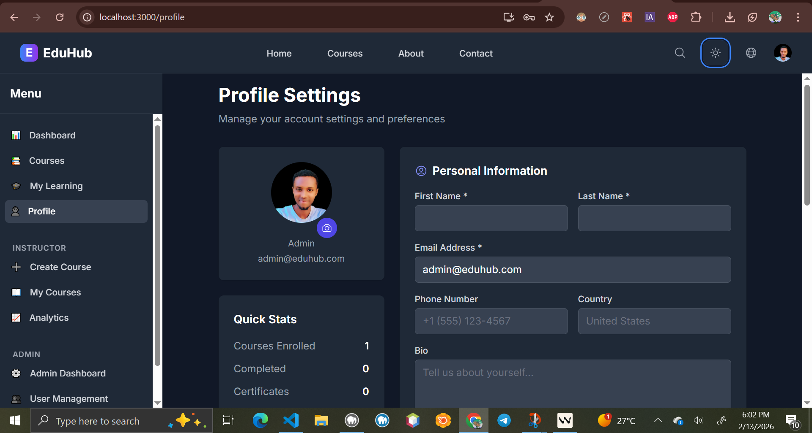
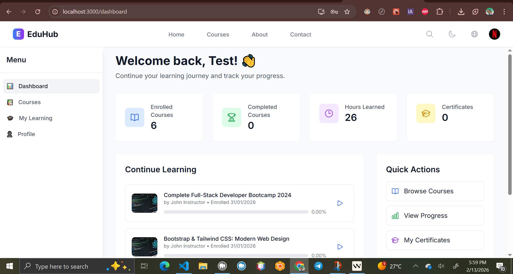

# EduHub - Complete E-Learning Platform

A full-featured, modern e-learning platform built with React.js, Node.js, MySQL, and Firebase.

## Screenshots

> **Note**: The screenshots below are placeholders. Please add actual screenshots by following the instructions in the [screenshots/README.md](./client/public/eduhub-1.png) file.

### Desktop View


_Main dashboard showing course listings and navigation_

### Mobile View


_Responsive design optimized for mobile devices_

### Course Player


_Interactive video player with course content_

### Admin Panel


_Comprehensive admin dashboard for platform management_

### User Profile


_User profile with progress tracking and achievements_

## Features

- **Multi-role System**: Students, Instructors, and Admins
- **Course Management**: Create, upload, and manage courses with videos, notes, and exercises
- **Interactive Learning**: Video streaming, quizzes, assignments, and forums
- **Real-time Features**: Live classes, notifications, and chat
- **Analytics & Tracking**: Progress monitoring and detailed analytics
- **Security**: JWT authentication, role-based access, HTTPS
- **Responsive Design**: Mobile-friendly with PWA support
- **Internationalization**: Multi-language support
- **Accessibility**: WCAG 2.1 compliant
- **Payment Integration**: Stripe for paid courses
- **AI Features**: Course recommendations and chatbot support

## Tech Stack

### Frontend

- React.js 18 with TypeScript
- Redux Toolkit for state management
- Tailwind CSS for styling
- React Router for navigation
- Socket.io for real-time features

### Backend

- Node.js with Express.js
- MySQL with Sequelize ORM
- Firebase for file storage and notifications
- JWT for authentication
- Socket.io for real-time communication

### Additional Services

- Stripe for payments
- SendGrid for emails
- Google Analytics for tracking
- Elasticsearch for search

## Setup Instructions

### Prerequisites

- Node.js (v16 or higher)
- MySQL (v8.0 or higher)
- Git

### Step-by-Step Setup

#### 1. Clone the Repository

```bash
git clone <repository-url>
cd EduHub
```

#### 2. Fix PowerShell Execution Policy (Windows Users)

If you encounter "execution of scripts is disabled" error, run PowerShell as Administrator and execute:

```powershell
Set-ExecutionPolicy -ExecutionPolicy RemoteSigned -Scope CurrentUser
```

#### 3. Install Dependencies

**Option A: Install all at once (from root directory)**

```bash
npm install
cd server && npm install
cd ../client && npm install
```

**Option B: Install separately**

```bash
# Install server dependencies
cd server
npm install

# Install client dependencies
cd ../client
npm install
```

#### 4. Environment Configuration

**Server Environment:**

```bash
cd server
cp .env.example .env
```

Edit `server/.env` with your database and other service credentials.

**Client Environment (if needed):**

```bash
cd client
# Create .env file if you have client-specific environment variables
```

#### 5. Database Setup

```bash
cd server
npm run db:setup
```

#### 6. Start the Application

**Option A: Start both servers simultaneously (from root)**

```bash
npm run dev
```

**Option B: Start servers separately**

Terminal 1 (Server):

```bash
cd server
npm run dev
```

Terminal 2 (Client):

```bash
cd client
npm start
```

#### 7. Access the Application

- **Frontend**: http://localhost:3000
- **Backend API**: http://localhost:5000

### Troubleshooting

#### Common Issues:

**1. "Cannot find module 'express'" Error**

- Make sure you've installed server dependencies: `cd server && npm install`

**2. "Scripts disabled" Error (Windows)**

- Run PowerShell as Administrator and execute: `Set-ExecutionPolicy RemoteSigned`

**3. Database Connection Issues**

- Verify MySQL is running
- Check database credentials in `server/.env`
- Ensure database exists or run `npm run db:setup`

**4. Port Already in Use**

- Server (5000): Change `PORT` in `server/.env`
- Client (3000): It will prompt to use a different port

**5. CORS Issues**

- Ensure client URL is added to server's CORS configuration

## Project Structure

```
eduhub/
├── client/                 # React frontend
│   ├── public/
│   ├── src/
│   │   ├── components/     # Reusable components
│   │   ├── pages/         # Page components
│   │   ├── store/         # Redux store
│   │   ├── services/      # API services
│   │   ├── utils/         # Utility functions
│   │   └── styles/        # Global styles
├── server/                # Node.js backend
│   ├── controllers/       # Route controllers
│   ├── models/           # Database models
│   ├── middleware/       # Custom middleware
│   ├── routes/           # API routes
│   ├── services/         # Business logic
│   └── utils/            # Utility functions
├── database/             # Database scripts
└── docs/                # Documentation
```

## Deployment

See [DEPLOYMENT.md](./DEPLOYMENT.md) for detailed deployment instructions for various platforms.

## Contributing

1. Fork the repository
2. Create a feature branch
3. Make your changes
4. Add tests
5. Submit a pull request

## License

MIT License - see [LICENSE](./LICENSE) file for details.

## 👥 Sample Users & Data

The application comes with pre-configured sample data for testing and demonstration:

### User Accounts

| Email                 | Password      | Role       | Description                             |
| --------------------- | ------------- | ---------- | --------------------------------------- |
| admin@eduhub.com      | admin123      | Admin      | Platform administrator with full access |
| instructor@eduhub.com | instructor123 | Instructor | Course creator and instructor           |
| student@eduhub.com    | student123    | Student    | Regular student account                 |
| test@example.com      | Test123!      | Student    | Test user account                       |

### Sample Courses Available

- **Complete React Developer Course 2024** ($89.99) - 42 hours
  - Beginner level, Web Development category
  - 1,247 enrollments, 4.8/5 rating
- **Node.js & Express: Backend Development Masterclass** ($79.99) - 38 hours
  - Intermediate level, Web Development category
  - 892 enrollments, 4.7/5 rating
- **Data Science with Python: From Zero to Hero** ($99.99) - 52 hours
  - Beginner level, Data Science category
  - 634 enrollments, 4.6/5 rating
- **UI/UX Design Fundamentals** ($69.99) - 32 hours
  - Beginner level, Design category
  - 423 enrollments, 4.9/5 rating
- **Full-Stack JavaScript: MERN Stack Development** ($109.99) - 48 hours
  - Intermediate level, Web Development category
  - 756 enrollments, 4.8/5 rating

### Sample Enrollments

- Student accounts have realistic enrollment data with progress tracking
- Some courses marked as completed with certificates
- Progress percentages and last accessed dates included

### User Profiles

All users have detailed profiles including:

- Professional bios and descriptions
- Contact information
- Country and preferences
- Points and level system
- Realistic profile data for testing

## 🔧 Development Tools

### Useful Scripts

```bash
# Seed sample data (run after database setup)
cd server
node seed-sample-data.js

# Check users in database
node check-users.js

# Fix user passwords if needed
node fix-passwords.js
```

### Database Management

- All sample data is automatically created when you run the schema
- Additional sample courses and enrollments can be added using the seeding script
- User passwords are properly hashed using bcrypt

## 🎯 What's Working

✅ **Authentication System**

- User registration and login
- JWT token-based authentication
- Role-based access control (Admin, Instructor, Student)
- Password hashing and validation

✅ **Course Management**

- Course creation and editing
- Category organization
- Pricing and enrollment tracking
- Course ratings and reviews system

✅ **User Management**

- User profiles with detailed information
- Progress tracking and certificates
- Points and level system
- Admin user management

✅ **Frontend Features**

- Responsive React application
- Redux state management
- Protected routes
- Toast notifications
- Modern UI with Tailwind CSS

✅ **Backend API**

- RESTful API endpoints
- Database integration with Sequelize
- Error handling and logging
- Rate limiting and security middleware

The EduHub platform is now fully functional with realistic sample data for testing and demonstration purposes!
